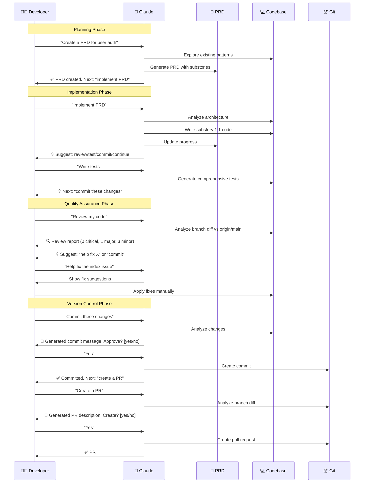

# 🚀 Yespark Claude Plugins

[](CHANGELOG.md)

**Supercharge your development workflow with AI-powered skills tailored for :**

[](.claude/skills/README.md)
[](.claude/skills/README.md)
[](.claude/skills/README.md)

| | Skill | Purpose |
|-|-------|---------|
| 📋 | **generate-prd** | Create adaptive PRDs with codebase exploration |
| 💻 | **implement-code** | Write code substory-by-substory from PRDs |
| 🧪 | **implement-tests** | Write comprehensive test suites |
| 📊 | **track-prd-progress** | Track and update PRD implementation status |
| 💾 | **commit** | Generate well-formatted commit messages |
| 🚀 | **create-pr** | Generate comprehensive PR descriptions |
| 🔍 | **code-review** | Multi-dimensional code quality analysis |

📖 For detailed information about individual skills, see [.claude/skills/README.md](.claude/skills/README.md)

---

## 📦 Installation

### 1️⃣ Install Claude Code or use Cursor Claude extension:

```sh
bun -g install @anthropic-ai/claude-agent-sdk
```

### 2️⃣ Add to your project's `.claude/settings.json` ⚙️:

```json
{
  "extraKnownMarketplaces": {
    "yespark-team-marketplace": {
      "source": {
        "source": "github",
        "repo": "yespark/yespark-claude-plugins"
      }
    }
  },
  "enabledPlugins": [
    "yespark-team-marketplace:workflow-skills"
  ]
}
```

### 3️⃣ Navigate to your project directory and run `claude` 🎯

### 4️⃣ Start Using 🎉

Just talk naturally! No slash commands needed. 🗣️✨

```
You:    "Create a PRD for user authentication"
Claude: [Asks questions, generates PRD]

You:    "Implement the PRD"
Claude: [Writes code substory by substory]

You:    "Review my code"
Claude: [Performs quality analysis]

You:    "Commit these changes"
Claude: [Generates commit message, waits for approval]

You:    "Create a PR"
Claude: [Generates PR description, waits for approval]
```

## 🔄 Workflow Example



## 📝 Complete Workflow Example

<details>
<summary>💬 Click to see a full conversation showing all 7 skills in action</summary>

<br>

```
You: "I want to build a parking reservation feature"

Claude: [generate-prd activates]
        🔍 Exploring codebase...
        Found: Existing booking patterns in app/services/booking/
        ✨ Detected: FULL mode PRD

        [Asks 15 questions]

        ✅ Created PRD at docs/prds/2024-10-25-parking-reservation.md

        💡 Next: "implement PRD" to start coding

You: "Implement PRD"

Claude: [implement-code activates]
        🔍 Analyzing Rails architecture...
        📋 Implementing substory 1.1: Reservation model...

        ✅ Substory 1.1 complete!

        💡 Next steps:
        - "review my code" - Check quality
        - "write tests" - Add test coverage
        - "commit these changes" - Save progress
        - "continue to 1.2" - Next substory

        What would you like?

You: "Write tests"

Claude: [implement-tests activates]
        🔍 Detected: RSpec + FactoryBot
        ✅ Writing tests...

        📊 Coverage: 78% → 94% (+16%)
        All tests passing ✅

        💡 Next: "commit these changes"

You: "Review my code first"

Claude: [code-review activates]
        📊 Standard Review (247 lines, 8 files)

        ✅ Review complete!
        - 🔴 0 critical
        - 🟠 1 major (missing index)
        - 🟡 3 minor

        💡 Next: "help fix X" or "commit"

You: "Help fix the index issue"

Claude: [Shows fix, you apply it]

You: "Commit these changes"

Claude: [commit activates]
        📊 8 files, 247 lines

        📝 Generated:
        feat(booking): add reservation model with tests
        [Shows message]

        Proceed? [yes/no]

You: "Yes"

Claude: ✅ Committed: a1b2c3d

        💡 Next: "create a PR" or "continue to 1.2"

You: "Create a PR"

Claude: [create-pr activates]
        📝 Generated PR:
        Title: feat(booking): add reservation model
        [Shows description]

        Create? [yes/no]

You: "Yes"

Claude: ✅ PR #123 created!
        🔗 https://github.com/yespark/app/pull/123
```

**Notice:** You control every step. Skills suggest, you decide. 🎮

</details>
